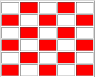

# Exercicis Matrius
## Exercici 1
Omple la funció 'paintAll' de manera que totes les cel·les de la taula es pintin de vermell:

## Exercici 2
Omple la funció 'erase' de manera que totes les cel·les de la taula s'esborrin (es pintin de blanc)

## Exercici 3
Omple la funció 'paintLeftHalf' de manera que la meitat horitzontal esquerra de la taula es quedi pintada.

## Exercici 4
Omple la funció 'paintRightHalf' de manera que la meitat horitzontal dreta de la taula es quedi pintada

## Exercici 5
Omple la funció 'paintUpperHalf' de manera que la meitat vertical de la taula es quedi pintada

## Exercici 6
Omple la funció 'paintLowerTriangle' de manera que el triangle inferior (sense la diagonal) quedi pintat.

## Exercici 7
Omple la funció 'paintUpperTriangle' de manera que el triangle superior (amb la diagonal) quedi pintat.

## Exercici 8
Omple la funció 'paintPerimeter' de manera que el perímetre quedi pintat.

## Exercici 9
Omple la funció 'paintCheckerboard' de manera que quedin pintades les cel·les com un taulell d'escacs

## Exercici 10
Com l'exercici anterior però amb el patró invertit. (Els que estaven pintats passen a no ser-ho i viceversa)

## Proves
El botó 'Test' fa proves i treu el resultat per consola. Comproveu que us surti tot bé.
Recordeu que heu de fer totes les funcions que funcionin per qualsevol mida de taula.
